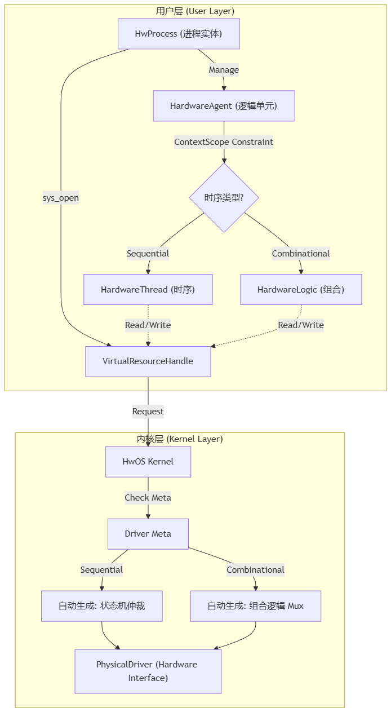

# HwOS: 基于 Chisel 的类操作系统硬件描述框架

**HwOS** 是一个基于 [Chisel](https://www.chisel-lang.org/) (v7.0.0) 构建的实验性硬件描述框架。旨在将高级软件操作系统的概念（如内核管理、进程抽象、虚拟资源句柄、系统调用等）引入 RTL 设计中，以解决复杂硬件系统的资源管理与逻辑解耦问题。

## 📖 项目简介

在传统的硬件设计中，模块间的互联往往是静态且紧耦合的。HwOS 提出了一种新的设计范式：

* **硬件即进程 (Hardware as a Process)**：将硬件逻辑模块抽象为拥有 PID、父子关系和生命周期的 `HwProcess`。
* **资源即文件 (Resource as a File)**：所有的硬件资源（寄存器堆、总线接口、PC、流水线寄存器）都被封装为 `PhysicalDriver`，并通过统一的虚拟句柄 (`VirtualResourceHandle`) 进行访问。
* **集中式内核 (Centralized Kernel)**：由 `Kernel` 负责管理所有驱动的挂载，并自动生成资源仲裁器 (Arbiter)，处理多个进程对同一硬件资源的竞争访问。
* **显式时序契约 (Explicit Timing Contract)**：利用 Scala 的类型系统，通过 HardwareAgent 和 ContextScope 在编译期强制检查时序逻辑与组合逻辑的边界。

该项目目前包含一个名为 `mycpu` 的示例实现，展示了如何使用 HwOS 构建一个基于 RISC-V 架构的 CPU 核心。

## ✨ 核心特性

* **硬件抽象层 (HAL)**:
* 提供 `Kernel` 类进行全局资源管理。
* 支持 `mount()` 挂载物理驱动，支持 `sys_open()` 获取资源句柄。


* **进程管理**:
* `HwProcess` 提供类似 OS 的进程上下文，拥有独立的 PID 和父子层级关系。
* 支持 `spawn` 原语来创建子进程（硬件子模块）。
* 内置 `HardwareThread` 和 `HardwareLogic` 用于描述时序逻辑和组合逻辑。


* **驱动生态**:
* **SmartAXIDriver**: 封装 AXI4 总线接口。
* **RegFileDriver**: 通用寄存器堆驱动。
* **PipeDriver**: 进程间通信 (IPC) 的管道驱动，支持深度配置。
* **PCDriver / CSRDriver**: 专用寄存器驱动。
* **TerminalDriver**: 调试与控制台交互。


* **自动仲裁机制**:
* 内核自动为多客户端（Clients）生成读写仲裁逻辑（Priority Encoder）。
* 支持组合逻辑读（Combinational）和时序逻辑读写（Sequential）两种时序模型。


* **验证友好**:
* 集成了 DPI (Direct Programming Interface) 接口，支持与 C++ 协同仿真（如 Verilator）。
* 内置 `InlineSimState` 和 `InlineSimEbreak` 用于指令提交监控。


## 🏗️ 架构概览

HwOS 的设计遵循以下层级结构：



### 1. Kernel (内核)

核心组件，维护驱动表 (`drivers`) 和客户端连接表 (`clients`)。调用 `kernel.boot()` 时，它会遍历所有注册的驱动，并未其生成相应的硬件仲裁逻辑。

### 2. Driver (驱动)

物理硬件的封装。所有的驱动必须继承自 `PhysicalDriver`。驱动定义了资源的读写行为（时序或组合）以及数据宽度。

* **示例**: `PipeDriver` 充当了传统 CPU 流水线寄存器的角色，但以文件读写的方式被 Fetch 和 Execute 阶段访问。

### 3. Process (进程)

逻辑的主要载体。一个 `HwProcess` 可以包含多个 `HardwareThread`。

* **Init 进程**: 系统的 1 号进程，负责初始化系统并 `spawn` 出其他核心业务进程（如 `FetchProcess`, `MainProcess`）。

## 🚀 快速开始

### 环境依赖

* Scala 2.13.16
* sbt (Scala Build Tool)
* Verilator (用于仿真)
* Mill (可选)

### 编译与运行

项目使用 sbt 进行构建管理。

1. **克隆仓库**
```bash
git clone https://github.com/your-org/HwOS.git
cd HwOS

```


2. **编译默认项目**
```bash
sbt run

```


## 💻 代码示例

以下代码展示了如何在 HwOS 中定义一个 CPU 核心并挂载资源，摘自 `src/main/scala/mycpu/Core.scala`：

```scala
class Core extends Module {
  // 1. 初始化内核
  implicit val kernel: Kernel = new Kernel()

  // 2. 挂载物理资源 (Drivers)
  // 挂载 AXI 总线接口
  val axiDrv = new SmartAXIDriver(io.master)
  kernel.mount(axiDrv)
  
  // 挂载寄存器堆和 CSR
  val rfVec  = RegInit(VecInit(Seq.fill(32)(0.U(32.W))))
  kernel.mount(new RegFileDriver(rfVec))
  
  // 挂载流水线管道
  kernel.mount(new PipeDriver("Fetch2Main", depth = 2))

  // 3. 定义并启动初始进程
  object Init extends HwProcess("Init")(None, kernel) {
    override def entry(): Unit = {
      // 孵化子进程：取指与主执行流
      spawn((p, k) => new MainProcess(p, k))().build()
      spawn((p, k) => new FetchProcess(p, k))().build()
    }
  }
  
  // 4. 构建与启动内核
  Init.build()
  kernel.boot() // 生成仲裁逻辑
}

```

在进程内部，你可以这样访问资源：

```scala
// 伪代码示例
val fetchPipe = sys_open("Fetch2Main")
// 像写文件一样写寄存器
fetchPipe.sys_write(addr,data)

```

## 📂 目录结构

```text
.
├── build.sbt                 # sbt 构建配置
├── LICENSE                   # Apache 2.0 许可证
├── src
│   └── main
│       └── scala
│           ├── HwOS
│           │   └── kernel    # 内核核心代码 (Kernel, HwProcess, VirtualResourceHandle)
│           │       └── drivers # 标准驱动实现 (AXI, Pipe, RegFile 等)
│           └── mycpu         # 示例项目：基于 HwOS 的 CPU 实现
│               ├── components # 具体的运算单元 (ALU, ImmGen)
│               ├── processes  # CPU 的各个流水级进程 (Fetch, Main)
│               └── Core.scala # 顶层模块

```

## 📄 许可证

本项目采用 **Apache License 2.0** 授权。
您可以自由地使用、复制、修改和分发本软件，但在分发修改后的文件时必须包含显著的声明，并保留原有的版权声明。详情请参阅 [LICENSE](https://www.google.com/search?q=LICENSE) 文件。

---

*Generated based on HwOS source code analysis.*