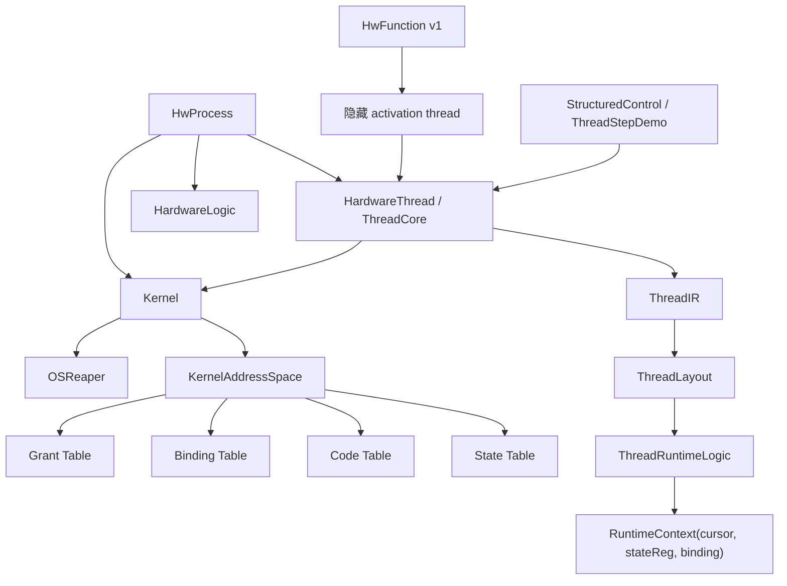
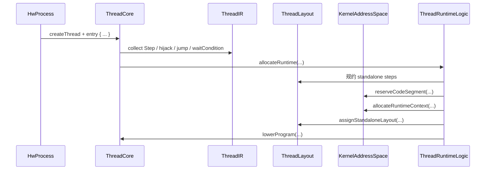
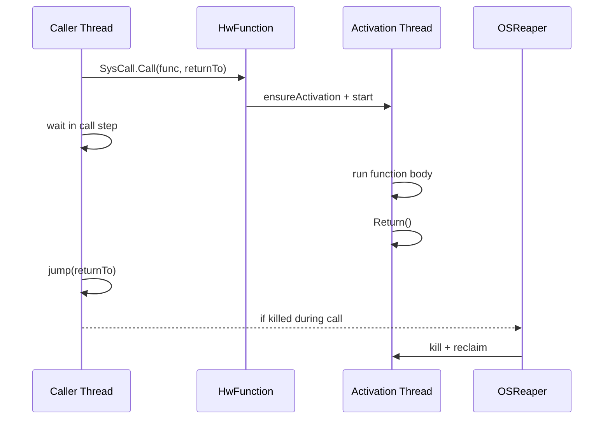

# HwOS 当前架构说明

相关文档：

- [愿景与定义](/Users/nullstarfish/HwOS_personal/docs/vision.md)
- [当前设计哲学](/Users/nullstarfish/HwOS_personal/docs/philosophy.md)
- [核心概念说明](/Users/nullstarfish/HwOS_personal/docs/concepts.md)
- [术语表](/Users/nullstarfish/HwOS_personal/docs/glossary.md)
- [Kernel API 指南](/Users/nullstarfish/HwOS_personal/docs/api/README.md)

这份文档面向接手开发的工程师，目标是说明 **当前代码真实实现**，而不是介绍愿景或历史版本。

本文重点回答四个问题：

1. HwOS 现在的主线是什么
2. 各个模块分别负责什么、又不负责什么
3. thread / function / kernel 在编译期和运行期如何配合
4. 当前已经锁定的设计决策有哪些

## 概览

当前 HwOS 的主线可以压成一句话：

- `thread` 是唯一正式控制流执行内核
- `StepRef` 是编译期 step 引用
- `RuntimeContext(cursor + stateReg + binding)` 是 thread runtime 的第一性模型
- `KernelAddressSpace` 负责 state / code / binding / grant 四类元数据
- thread runtime 通过 `ThreadRuntimeLease` 暴露给 OSReaper 作为系统侧兜底回收对象
- `HwFunction` 当前是 v1：隐藏 activation thread + blocking call

几个重要边界：

- `kernel.control` 不是 thread 真身，它只放高层控制 DSL 和 demo façade
- `hijack` 是编译期 splice，不是 runtime jump
- `exit` 是内核概念；用户态只应该看到 `Return`
- ABI 是编译期 metadata / 检查，不是运行时总线协议

## 模块职责

### `Kernel` / `KernelAddressSpace`

`Kernel` 是系统级壳子。它负责：

- 注册 process / thread / context
- 在 `boot()` 时生成 `Kernel/OSReaper`
- 触发 monitor / symbol dump / 地址表导出
- 持有唯一的 `KernelAddressSpace`

`Kernel` 不负责：

- thread 控制流 lowering 细节
- function body 的具体执行逻辑
- ACL 本身的判定细节

`KernelAddressSpace` 是当前所有元数据分配与导出的唯一入口。它负责：

- state 空间地址分配
- code 空间地址分配
- `RuntimeContext` 所需元数据绑定
- ABI grant 元数据登记
- 四张表的渲染与导出

当前四张表：

- `state table`
  - 真实硬件状态对象
  - 例如 `Reg`、cursor、thread `stateReg`、lease backing state
- `code table`
  - step/function 的控制编码空间
  - 不是 state 地址空间
- `binding table`
  - 把某个 runtime cursor/state 绑定到某段 code segment
- `grant table`
  - 记录 `grant` 的 ABI 语义

### `process` / `context`

`HwProcess` 负责结构搭建：

- 形成 process 层级
- 创建 thread / logic
- `spawn` 子 process
- 在 root process 上触发 `kernel.boot()`

`HwContext` / `HwContextEntity` 负责权限与 ownership：

- `own(...)` 注册状态对象 ownership
- `grant(...)` 授权写权限，并登记 ABI metadata
- `bindIsActive(...)` 把上下文活跃条件绑定到 runtime
- `kernelKillSignal` 是 context 级的系统切断机制

边界上要特别注意：

- `own` 只负责 ownership / state table 登记
- `grant` 负责 ACL 扩散和 ABI metadata
- ABI 挂在 `grant` 上，而不是 `own` 上

原因是：

- `own` 只说明“这是我的资源”
- `grant` 才说明“我要如何把它暴露给别人”

### `thread`

`HardwareAgent` 是统一执行体基类；`HardwareThread` 是 thread 形态的 agent。

`ThreadControlApi` 是 thread 的正式控制接口。当前正式主语义是：

- `Step(name) { ... }`
- `Next: StepRef`
- `stepRef(name): StepRef`
- `hijack(ref)`
- `jump(ref)`
- `waitCondition(cond)`

`StepRef` 现在只有两类：

- `NamedStepRef(name)`
- `NextStepRef`

它是纯编译期对象，不是 runtime 值。

`ThreadCore` 是 thread 的正式内核入口。它负责：

- 持有 thread 的 IR / layout / runtime 状态
- 绑定 `active/done/pc`
- 把 `entry { ... }` 收集并 lower
- 在 debug 模式下打印 step 执行轨迹
- 默认注册一份 thread runtime lease

`ThreadCore` 不负责：

- state / code 地址分配本体
- 高层 if/while/for 语法糖
- function activation 的调用协议

### `thread/step`

这一层是当前 thread 编译内核的三段式实现。

#### `ThreadIR`

负责收集控制流 IR：

- step 定义
- hijack 引用
- jump target
- global block

这里仍然完全是编译期语义。

#### `ThreadLayout`

负责 layout / 规约：

- 解析 `StepRef`
- 维护 current lowering step
- 规约 standalone step
- 给 standalone step 绑定 code slot
- 校验 jump target 是否真的有 standalone slot

#### `ThreadRuntimeLogic`

负责最终 lowering 成 runtime 行为：

- 分配 `RuntimeContext`
- 基于 `cursor === code_entry` 生成执行逻辑
- 建立默认 fallthrough
- 处理 `jump`
- 处理 `hijack`
- 处理 `waitCondition`

当前 thread runtime 的基本规则是：

- `active = stateReg === Running`
- `done = stateReg === Done`
- `start`: `cursor := entry` 且 `stateReg := Running`
- `exit`: `stateReg := Done`
- `reset`: `cursor := entry` 且 `stateReg := Idle`
- `thread_kill`: 走系统级 reclaim 路径，最终让 runtime 回到 `Idle`

### `function`

当前仓库同时有两类“函数”：

- `HwInline`
  - 纯 inline
  - 直接把逻辑 emit 到当前调用上下文
- `HwFunction`
  - 当前 v1 的真实函数模型

`HwFunction` 当前不是最终形态，而是 v1 方案：

- 每个 function 有一个隐藏 activation thread
- caller 通过 `SysCall.Call(HwFunction, returnTo)` 发起 blocking call
- caller 在 call step 阻塞等待
- activation thread 自己跑 function body
- activation `Return()` 后 caller 回到 continuation

当前已经补上的关键语义：

- 单 activation slot
- 显式 call binding
- caller kill 时 activation 连坐 kill / reclaim

`Return` 与 `exit` 的关系：

- 用户只有 `SysCall.Return()`
- `SysCall.exit()` 是 `private[kernel]`
- root 下没有 continuation 的 `Return()`，内部就会走 kernel exit

### `control`

`kernel.control` 现在不是 thread 真身，只放高层控制构造器和演示包装。

主要包括：

- `StructuredControl`
  - 高层 if / for / while / break / continue lowering 构造器
- `AutoControl`
  - 一些更高层的辅助控制包装
- `ThreadStepDemo`
  - demo façade
  - 复用 thread 主线
  - 不是 thread 的正式实现

## 关键数据结构

### `RuntimeContext`

当前 thread runtime 的第一性结构：

- `binding`
- `cursor`
- `stateReg`

语义：

- `cursor` 表示当前控制位置
- `stateReg` 表示 `Idle / Running / Done`
- `binding` 把这份 runtime state 和 code segment 联系起来

### `ThreadRuntimeLease`

每个 thread 默认都会注册一份 runtime lease。

语义：

- 它把 `RuntimeContext` 暴露给 OSReaper
- 它不是 thread lifecycle 本体
- 它是系统级 reclaim 的接入点之一
- 是否接管它，由 OSReaper/Kernel 侧决定，不写进 `RuntimeContext`

### `AddressObject`

统一的地址对象壳，但现在已经分成两套空间：

- `spaceTag = state`
- `spaceTag = code`

它们共用同一个对象模型，但不再共用一套编号。

这意味着：

- state 对象地址只在 state 空间内连续增长
- code 对象地址只在 code 空间内连续增长

### `GlobalCodeSegment`

表示一段 code space 控制编码：

- `ownerName`
- `objectName`
- `labels`
- `addresses`
- `startAddress`
- `entryAddress`

这里的 `startAddress / entryAddress` 已经是 **code space** 地址，不再是混合全局地址。

### `StepRef`

`StepRef` 是当前所有 `jump/hijack` 的正式目标表示：

- `NamedStepRef("Foo")`
- `NextStepRef`

它只在 collect / layout / lower 期间解析。

## 关键流程

### 1. thread build / lower 流程

thread 的完整路径大致是：

1. `HwProcess.createThread("Worker")`
2. `worker.entry { ... }`
3. `ThreadCore` 建立 `ThreadIR.IRState`
4. `Step / jump / hijack / waitCondition` 先进入 `ThreadIR`
5. `ThreadRuntimeLogic.allocateRuntime(...)`
6. `KernelAddressSpace.reserveCodeSegment(...)`
7. `KernelAddressSpace.allocateRuntimeContext(...)`
8. `ThreadLayout.assignStandaloneLayout(...)`
9. `ThreadRuntimeLogic.lowerProgram(...)`

### 2. `StepRef` 控制流流程

`jump(stepRef(...))`：

- `ThreadRuntimeLogic.emitJump(...)`
- `ThreadLayout.resolveStepRef(...)`
- 目标必须是 standalone step
- 最终写 `runtime.cursor.reg := targetPc`

`hijack(Next)` / `hijack(stepRef("Foo"))`：

- 先 resolve `StepRef`
- suppress 目标 step 的 standalone slot
- 当前 step 的默认 fallthrough 先建立
- 再把目标 step block 编译期 splice 进来

`waitCondition(cond)`：

- 不会让 cursor 跳进某个被 splice 的内部 step
- 它会 stall 回当前入口 step 的地址

standalone suppression 的意思是：

- 某个 step 不再有自己的独立 code slot
- 但它的 body 会被别的 step 在编译期展开使用

### 3. function call 流程

当前 `HwFunction` 的调用流程：

1. caller 进入 `SysCall.Call(func, returnTo)`
2. `func.ensureActivation(...)` 保证隐藏 activation thread 已存在
3. caller 生成一个 call wait step
4. 如果 activation 空闲：
   - 建立 call binding
   - `start(activation)`
   - caller 进入等待
5. activation thread 执行 function body
6. activation `Return()`
7. caller 检测 activation done，跳回 continuation

### 4. kill / reclaim 流程

当前 kill / reclaim 已经分成三层：

1. `kill(contextEntity)`
2. `thread_kill(thread)`
3. `thread reset`

普通 thread kill：

1. `SysCall.kill(targetThread)` 触发该 thread 的 context cut-off
2. `ctx.kernelKillSignal` 被拉高
3. `OSReaper` 观察到该 thread 的 context kill
4. `OSReaper` 对 active leases 执行 `forceReclaim`
5. runtime lease 执行 `resetRuntime()`
6. thread 最终回到 `Idle`

context kill：

1. `kill(contextEntity)` 写 `ctx.kernelKillSignal`
2. 对普通 context，这意味着 context 级切断
3. 对 thread context，OSReaper 默认会顺带接管其 runtime lease
4. runtime lease 执行 reset，使 thread 回到 `Idle`

function call 期间 kill：

1. caller 被 kill
2. call binding 识别当前 activation
3. activation 连坐 kill
4. activation 自己持有的 leases 被 `forceReclaim`
5. call binding 清理
6. caller 后续可 restart，不会被旧 activation 污染

## 当前设计决策

以下约定是当前主线，后续代码和文档都应围绕它们，而不是围绕历史实现：

- thread 没有多个 backend，只有统一 `ThreadCore`
- `StepRef` 是正式主语义；字符串跳转只是过渡包装
- `hijack` 是编译期 splice，不是 runtime jump
- `waitCondition` stall 在入口 step，不是某个内部 splice 位置
- `RuntimeContext(cursor + stateReg + binding)` 是 thread runtime 的第一性模型
- thread lifecycle 不再依赖 lifecycle lease 主语义
- context kill 与 thread kill 已分离
- OSReaper 通过 runtime lease 在系统侧决定是否接管 thread runtime
- ABI 是编译期 metadata / check，不是运行时总线协议
- state 和 code 是两套独立地址空间
- `exit` 是内核概念，不是用户 API
- `ThreadStepDemo` 是 demo façade，不是 kernel 真身
- `HwFunction` 还是 v1，而不是最终 function 架构

## 已知局限

当前真实存在、且对接手开发有帮助的局限包括：

- `HwFunction` 仍然是 v1：
  - 单 activation slot
  - 隐藏 activation thread
  - 不是最终 function runtime 形态
- 仓库里仍然会看到不少 `lastconnect warning`
  - 当前测试主线已经接受这些 warning
  - 它们不等于当前语义错误
- README 里仍有少量概念性描述和当前实现不完全同步
  - 这轮只做最小纠偏，不重写整篇 README

## 建议阅读顺序

如果你要接手当前主线，建议按这个顺序读代码：

1. [src/main/scala/HwOS/kernel/thread/ThreadCore.scala](/Users/nullstarfish/HwOS_personal/src/main/scala/HwOS/kernel/thread/ThreadCore.scala)
2. [src/main/scala/HwOS/kernel/thread/step/ThreadIR.scala](/Users/nullstarfish/HwOS_personal/src/main/scala/HwOS/kernel/thread/step/ThreadIR.scala)
3. [src/main/scala/HwOS/kernel/thread/step/ThreadLayout.scala](/Users/nullstarfish/HwOS_personal/src/main/scala/HwOS/kernel/thread/step/ThreadLayout.scala)
4. [src/main/scala/HwOS/kernel/thread/step/ThreadRuntimeLogic.scala](/Users/nullstarfish/HwOS_personal/src/main/scala/HwOS/kernel/thread/step/ThreadRuntimeLogic.scala)
5. [src/main/scala/HwOS/kernel/system/KernelAddressSpace.scala](/Users/nullstarfish/HwOS_personal/src/main/scala/HwOS/kernel/system/KernelAddressSpace.scala)
6. [src/main/scala/HwOS/kernel/system/SysCall.scala](/Users/nullstarfish/HwOS_personal/src/main/scala/HwOS/kernel/system/SysCall.scala)
7. [src/main/scala/HwOS/kernel/function/HwFunction.scala](/Users/nullstarfish/HwOS_personal/src/main/scala/HwOS/kernel/function/HwFunction.scala)
8. [src/main/scala/HwOS/kernel/control/StructuredControl.scala](/Users/nullstarfish/HwOS_personal/src/main/scala/HwOS/kernel/control/StructuredControl.scala)

如果要看最小、最纯的可行性演示，再看：

- [src/main/scala/HwOS/kernel/control/ThreadStepDemo.scala](/Users/nullstarfish/HwOS_personal/src/main/scala/HwOS/kernel/control/ThreadStepDemo.scala)
