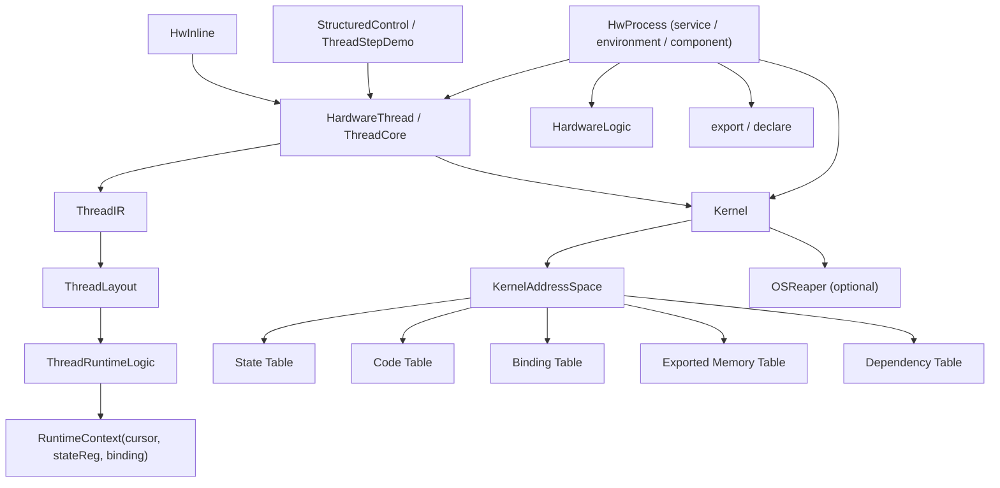

# HwOS 当前架构说明

相关文档：

- [愿景与定义](/Users/nullstarfish/HwOS_personal/docs/vision.md)
- [当前设计哲学](/Users/nullstarfish/HwOS_personal/docs/philosophy.md)
- [核心概念说明](/Users/nullstarfish/HwOS_personal/docs/concepts.md)
- [术语表](/Users/nullstarfish/HwOS_personal/docs/glossary.md)
- [Kernel API 指南](/Users/nullstarfish/HwOS_personal/docs/api/README.md)

这份文档面向接手开发的工程师，目标是说明 **当前代码真实实现**，而不是介绍愿景或历史版本。

本文重点回答四个问题：

1. HwOS 现在的主线是什么
2. 各个模块分别负责什么、又不负责什么
3. thread / function / kernel 在编译期和运行期如何配合
4. 当前已经锁定的设计决策有哪些

## 概览

当前 HwOS 的主线可以压成一句话：

- `thread` 是唯一正式控制流执行宿主
- `StepRef` 是编译期 step 引用
- `RuntimeContext(cursor + stateReg + binding)` 是 thread runtime 的第一性模型
- `HwInline` 是运行在 thread 上的控制代码段
- `HwProcess` 当前更接近 service / environment / physical component
- `KernelAddressSpace` 负责 state / code / binding / exported / dependency 五类元数据
- `OSReaper` 是可选系统服务，不是基础运行模型的默认组成部分

几个重要边界：

- `kernel.control` 不是 thread 真身，它只放高层控制 DSL 和 demo façade
- `hijack` 是编译期 splice，不是 runtime jump
- `exit` 是内核概念；用户态只应该看到 `Return`
- `export / declare` 当前只承担可见性与依赖记录
- 普通 thread 的基础终止原语是 `reset()`

## 模块职责

### `Kernel` / `KernelAddressSpace`

`Kernel` 是系统级壳子。它负责：

- 注册 process / thread
- 在 `boot()` 时生成 `Kernel/OSReaper`
- 触发 monitor / symbol dump / 地址表导出
- 持有唯一的 `KernelAddressSpace`

`Kernel` 不负责：

- thread 控制流 lowering 细节
- function body 的具体执行逻辑
- 业务对象自己的资源仲裁

`KernelAddressSpace` 是当前所有元数据分配与导出的唯一入口。它负责：

- state 空间地址分配
- code 空间地址分配
- `RuntimeContext` 所需元数据绑定
- `exported memory table` 登记
- `dependency table` 登记
- 五张表的渲染与导出

当前五张表：

- `state table`
  - 被 kernel 跟踪的真实硬件状态对象
  - 例如 `Reg`、cursor、thread `stateReg`、export backing state
- `code table`
  - step/function 的控制编码空间
- `binding table`
  - 把某个 runtime cursor/state 绑定到某段 code segment
- `exported memory table`
  - 记录显式 `export(...)` 的资源
- `dependency table`
  - 记录显式 `declare(...)` 的依赖

### `process` / `context`

`HwProcess` 当前负责环境与装配：

- 形成 process 层级
- 持有本地状态
- 创建 thread / logic
- `install(threadDef, name)` 安装 definition-first thread
- `spawn` 子 process
- 在 root process 上触发 `kernel.boot()`

`HwProcess` 当前不负责：

- code space 本体
- thread runtime
- 旧式资源 ACL 扩散

`HwContext` / `HwContextEntity` 当前已经收成最小上下文壳。它主要负责：

- entity 身份
- kernel 挂接
- `export(...)`
- `declare(...)`

当前已经不再负责：

- `own / grant`
- ACL registry
- `kernelKillSignal`

### `thread`

`HardwareAgent` 是统一执行体基类；`HardwareThread` 是 thread 形态的 agent。

`ThreadControlApi` 是 thread 的正式控制接口。当前正式主语义是：

- `Step(name) { ... }`
- `Next: StepRef`
- `stepRef(name): StepRef`
- `hijack(ref)`
- `jump(ref)`
- `waitCondition(cond)`

`StepRef` 现在只有两类：

- `NamedStepRef(name)`
- `NextStepRef`

它是纯编译期对象，不是 runtime 值。

`ThreadCore` 是 thread 的正式内核入口。它负责：

- 持有 thread 的 IR / layout / runtime 状态
- 绑定 `active/done/pc`
- 把 `entry { ... }` 收集并 lower
- 在 debug 模式下打印 step 执行轨迹

`ThreadCore` 不负责：

- state / code 地址分配本体
- 高层 if/while/for 语法糖
- OSReaper 的系统级收尾策略

### `ThreadDef`

`ThreadDef` 是 definition-first 的 thread code 对象。它负责：

- 在单文件里定义 thread code
- 通过 `define(thread)` 把 code 安装到 thread 实例

`HwProcess.install(threadDef, name)` 负责：

- 创建 thread 实例
- 调用 `ThreadDef.define(...)`

也就是说：

- `ThreadDef` 负责 code definition
- `HwProcess` 负责环境与装配

### `thread/step`

这一层是当前 thread 编译内核的三段式实现。

#### `ThreadIR`

负责收集控制流 IR：

- step 定义
- hijack 引用
- jump target
- global block

#### `ThreadLayout`

负责 layout / 规约：

- 解析 `StepRef`
- 维护 current lowering step
- 规约 standalone step
- 给 standalone step 绑定 code slot
- 校验 jump target 是否真的有 standalone slot

#### `ThreadRuntimeLogic`

负责最终 lowering 成 runtime 行为：

- 分配 `RuntimeContext`
- 基于 `cursor === code_entry` 生成执行逻辑
- 建立默认 fallthrough
- 处理 `jump`
- 处理 `hijack`
- 处理 `waitCondition`

当前 thread runtime 的基本规则是：

- `active = stateReg === Running`
- `done = stateReg === Done`
- `start`: `cursor := entry` 且 `stateReg := Running`
- `exit`: `stateReg := Done`
- `reset`: `cursor := entry` 且 `stateReg := Idle`

### `function`

当前主线只有 `HwInline` 这一个正式控制段 API：

- `HwInline`
  - 可作为 inline 控制段
  - 也可作为 callable segment（`SysCall.Call(HwInline, ...)`）
  - 不自带隐藏 activation thread

### `control`

`kernel.control` 现在不是 thread 真身，只放高层控制构造器和演示包装。

主要包括：

- `StructuredControl`
  - 高层 if / for / while / break / continue lowering 构造器
- `AutoControl`
  - 一些更高层的辅助控制包装
- `ThreadStepDemo`
  - demo façade
  - 复用 thread 主线
  - 不是 thread 的正式实现

## 关键数据结构

### `RuntimeContext`

当前 thread runtime 的第一性结构：

- `binding`
- `cursor`
- `stateReg`

语义：

- `cursor` 表示当前控制位置
- `stateReg` 表示 `Idle / Running / Done`
- `binding` 把这份 runtime state 和 code segment 联系起来

### `AddressObject`

统一的地址对象壳，但当前已经分成两套空间：

- `spaceTag = state`
- `spaceTag = code`

这意味着：

- state 对象地址只在 state 空间内连续增长
- code 对象地址只在 code 空间内连续增长

### `GlobalCodeSegment`

表示一段 code space 控制编码：

- `ownerName`
- `objectName`
- `labels`
- `addresses`
- `startAddress`
- `entryAddress`

这里的 `startAddress / entryAddress` 已经是 **code space** 地址。

### `ExportedMemoryEntry`

表示一条显式导出的 symbolic 资源。

它至少包含：

- `symbolName`
- `ownerName`
- backing address object
- capability
- type summary

### `MemoryDependencyEntry`

表示一条显式的 symbolic 依赖。

它至少包含：

- requester name
- target symbol
- resolved owner
- requested capability
- resolved capability

## 关键流程

### 1. thread build / lower 流程

thread 的完整路径大致是：

1. `HwProcess.createThread("Worker")`
2. 或 `HwProcess.install(threadDef, "Worker")`
3. `worker.entry { ... }`
4. `ThreadCore` 建立 `ThreadIR.IRState`
5. `Step / jump / hijack / waitCondition` 先进入 `ThreadIR`
6. `ThreadRuntimeLogic.allocateRuntime(...)`
7. `KernelAddressSpace.reserveCodeSegment(...)`
8. `KernelAddressSpace.allocateRuntimeContext(...)`
9. `ThreadLayout.assignStandaloneLayout(...)`
10. `ThreadRuntimeLogic.lowerProgram(...)`

### 2. `StepRef` 控制流流程

`jump(stepRef(...))`：

- `ThreadRuntimeLogic.emitJump(...)`
- `ThreadLayout.resolveStepRef(...)`
- 目标必须是 standalone step
- 最终写 `runtime.cursor.reg := targetPc`

`hijack(Next)` / `hijack(stepRef("Foo"))`：

- 先 resolve `StepRef`
- suppress 目标 step 的 standalone slot
- 当前 step 的默认 fallthrough 先建立
- 再把目标 step block 编译期 splice 进来

`waitCondition(cond)`：

- 不会让 cursor 跳进某个被 splice 的内部 step
- 它会 stall 回当前入口 step 的地址

### 3. callable segment 流程

当前 `HwInline` 的可调用流程：

1. caller 进入 `SysCall.Call(inlineSeg, returnTo)`
2. call-site continuation 被记录到返回边
3. inline segment 执行并在显式 `SysCall.Return()` 处退出
4. caller 跳回 continuation

### 4. symbolic v0 流程

symbolic v0 的路径非常轻：

1. provider/process 显式 `export(symbol, signal, caps)`
2. `KernelAddressSpace` 记录 exported memory entry
3. consumer/thread/logic 显式 `declare(symbol, caps)`
4. `KernelAddressSpace` 记录 dependency entry
5. 使用方通过 `VirtualHandle.read / write` 访问

这里特别要注意：

- 同一 process 内的本地实现不强制走 symbolic
- 只有跨边界可见性与依赖记录才使用 `export / declare`

### 5. reset / kill / reclaim 流程

普通 thread：

1. `SysCall.kill(thread)` 发起系统终止
2. 如果没有显式 OSReaper 神力接入，最终直接落到 `thread.reset()`
3. `reset()` 使：
   - `cursor := entry`
   - `stateReg := Idle`

显式接入 `OSReaperManaged` 的对象：

1. 系统先执行 reaper cleanup / forced reclaim
2. 再让关联 thread 最终回到 `reset()`

因此：

- `reset()` 是基础原语
- 即时截断与强制收尾是附加系统能力

### 6. prototype CPU 组织流程（ServerInjected）

当前 `prototype/cpu` 的主线组织已经切成显式前后端容器：

- `BackendProcess`
  - `regFile`
  - `ArithmeticServiceProcess`
  - `LoadServiceProcess`
  - `CommitServiceProcess`
  - `AddiPathProcess` / `LoadPathProcess` / `LoadAddPathProcess`
- `FrontendProcess`
  - `ServerDecodeProcess`
  - `ServerFetchProcess`

当前关键行为约束：

- decode 负责 `Reserve(rd)` 的时机保证
- path 负责异步推进 execute 生命周期
- commit 独立负责 `WritebackAndClear`
- load/arith 的结构仲裁仅保留在 service 层

## 当前设计决策

以下约定是当前主线，后续代码和文档都应围绕它们：

- thread 没有多个 backend，只有统一 `ThreadCore`
- `StepRef` 是正式主语义；字符串跳转只是过渡包装
- `hijack` 是编译期 splice，不是 runtime jump
- `RuntimeContext(cursor + stateReg + binding)` 是 thread runtime 的第一性模型
- `Process` 当前应理解为 service / environment / physical component
- `ThreadDef` 是 definition-first 的 thread code 接口
- `HwInline` 是控制代码段，不是软件 function 的直接翻版
- `export / declare` 构成 lightweight symbolic v0
- `KernelAddressSpace` 不再维护 `grant table`
- `OSReaper` 是可选系统服务，不是基础模型默认部分
- `exit` 是内核概念，不是用户 API
- `HwFunction` 已从当前主线移除

## 已知局限

当前真实存在、且对接手开发有帮助的局限包括：

- callable segment 当前统一使用 `HwInline`
- symbolic v0 还很轻：
  - 只支持精确符号名
  - 还没有 namespace / 模糊匹配
  - 还不是完整链接器
- 当前仓库里仍会看到不少旧风格痕迹和迁移遗留警告
  - 尤其是一些由旧 `own(...)` 去除后留下的纯表达式 warning

## 建议阅读顺序

如果你要接手当前主线，建议按这个顺序读代码：

1. [src/main/scala/HwOS/kernel/thread/ThreadCore.scala](/Users/nullstarfish/HwOS_personal/src/main/scala/HwOS/kernel/thread/ThreadCore.scala)
2. [src/main/scala/HwOS/kernel/thread/ThreadDef.scala](/Users/nullstarfish/HwOS_personal/src/main/scala/HwOS/kernel/thread/ThreadDef.scala)
3. [src/main/scala/HwOS/kernel/thread/step/ThreadIR.scala](/Users/nullstarfish/HwOS_personal/src/main/scala/HwOS/kernel/thread/step/ThreadIR.scala)
4. [src/main/scala/HwOS/kernel/thread/step/ThreadLayout.scala](/Users/nullstarfish/HwOS_personal/src/main/scala/HwOS/kernel/thread/step/ThreadLayout.scala)
5. [src/main/scala/HwOS/kernel/thread/step/ThreadRuntimeLogic.scala](/Users/nullstarfish/HwOS_personal/src/main/scala/HwOS/kernel/thread/step/ThreadRuntimeLogic.scala)
6. [src/main/scala/HwOS/kernel/system/KernelAddressSpace.scala](/Users/nullstarfish/HwOS_personal/src/main/scala/HwOS/kernel/system/KernelAddressSpace.scala)
7. [src/main/scala/HwOS/kernel/system/SysCall.scala](/Users/nullstarfish/HwOS_personal/src/main/scala/HwOS/kernel/system/SysCall.scala)
8. [src/main/scala/HwOS/kernel/function/HwInline.scala](/Users/nullstarfish/HwOS_personal/src/main/scala/HwOS/kernel/function/HwInline.scala)
9. [src/main/scala/HwOS/kernel/examples/symbolic/CounterWorkerThreadUnit.scala](/Users/nullstarfish/HwOS_personal/src/main/scala/HwOS/kernel/examples/symbolic/CounterWorkerThreadUnit.scala)
