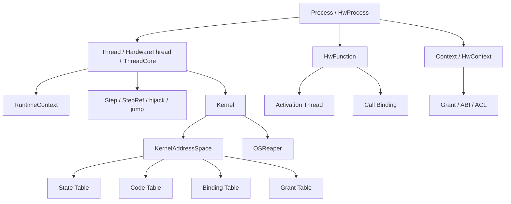
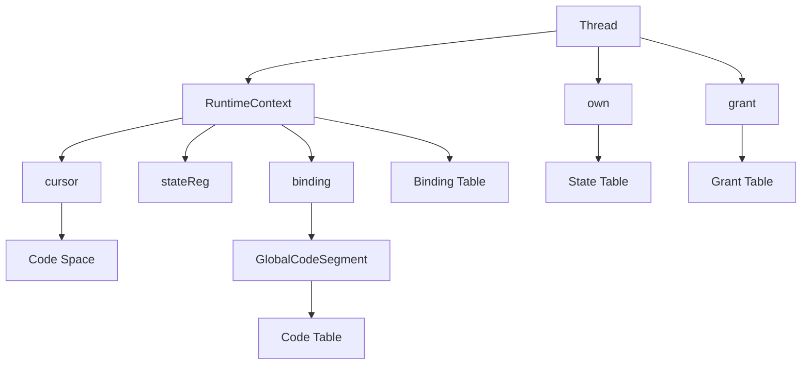

# HwOS 核心概念说明

这份文档讲的是 **当前系统的概念和心智模型**。  
如果你想看实现结构，请读 [architecture.md](/Users/nullstarfish/HwOS_personal/docs/architecture.md)。  
如果你想看更高层的设计哲学，请读 [philosophy.md](/Users/nullstarfish/HwOS_personal/docs/philosophy.md)。

## 概览

当前系统可以用下面这张图快速把握：

## Process

### 它是什么

`HwProcess` 是结构和所有权层级的容器。

它负责：

- 形成 process 层级
- 创建 thread / logic
- `spawn` 子 process
- 在 root 上触发 `kernel.boot()`

### 它不是什么

- 它不是 thread runtime
- 它不是 code segment
- 它不是 function activation

### 它的边界

`HwProcess` 主要解决“谁拥有谁、谁创建谁”的问题。  
具体控制流执行则交给 `thread`。

## Context

### 它是什么

`HwContext` / `HwContextEntity` 是权限与可达性的语义边界。

它负责：

- ownership 归属
- ACL 扩散
- `bindIsActive(...)`
- `kernelKillSignal`

### 它不是什么

- 它不是执行单元
- 它不是地址分配器
- 它不是 thread runtime 本体

### 它的边界

thread 决定“谁在执行”，context 决定“这个执行体当前能合法触碰什么”。

当前还要补一条边界：

- `kernelKillSignal` 是 context 级 cut-off
- 它不再天然等价于 thread kill

## Ownership

### 它是什么

`own(...)` 表示：

- 某个状态对象归属于当前 context / owner
- 该对象会进入 `state table`

### 它不是什么

- 它不是对外接口声明
- 它不是 ABI
- 它不说明别人如何使用这个对象

### 它的边界

`own` 只说“这是我的”。  
如果要让别人访问它，必须再通过 `grant(...)`。

## Grant

### 它是什么

`grant(...)` 表示：

- 把某个对象的写入或交互权限授权给别的 target
- 同时给这个交互挂上 ABI metadata

### 它不是什么

- 它不是 ownership
- 它不是 runtime bus 协议
- 它不是自动代码生成框架

### 它的边界

`own` 说明归属，`grant` 说明暴露方式。  
所以 ABI 绑定在 `grant` 上，而不是 `own` 上。

## ABI

### 它是什么

ABI 是当前系统中的**编译期交互语义**，现在主要体现在 `grant table` 中。

当前正式类型包括：

- `GrantAbi.RegisterWrite`
- `GrantAbi.LevelDrivenWire`
- `GrantAbi.PulseWire`

### 它不是什么

- 它不是运行时总线协议
- 它不是自动握手控制器
- 它不是新的硬件通信语言

### 它的边界

ABI 现在负责：

- 约束 `grant` 的写法
- 导出交互意图
- 防止错误地把 wire 当 reg 暴露

它不负责在运行时解释协议。

## Thread

### 它是什么

`HardwareThread` + `ThreadCore` 是当前系统唯一正式的控制流执行单元。

它负责：

- 收集 `entry { ... }`
- 持有 `RuntimeContext`
- 执行 `Step` 控制流
- 响应 `start / kill / Return`
- 持有 thread 自己的 runtime kill / reset 语义

### 它不是什么

- 它不是 process
- 它不是 function 本体
- 它不是高层 DSL

### 它的边界

process 是结构容器，thread 是执行体。  
function 当前 v1 则是借助隐藏 activation thread 来获得调用语义。

## Step

### 它是什么

`Step` 是 thread 内部的正式控制点。

### 它不是什么

- 它不是寄存器
- 它不是 runtime node 对象
- 它不是一条软件指令

### 它的边界

运行期存在的是 cursor；  
`Step` 是编译期控制点，最终会被映射到 code space 编号。

## StepRef

### 它是什么

`StepRef` 是编译期 step 引用。

当前只有两类：

- `NamedStepRef(name)`
- `NextStepRef`

### 它不是什么

- 它不是 runtime 值
- 它不是地址寄存器
- 它不是 pointer 算术系统

### 它的边界

`jump` 和 `hijack` 的正式目标都是 `StepRef`。  
字符串跳转只是过渡包装，不是主语义。

## Hijack

### 它是什么

`hijack(ref)` 是对某个 `StepRef` 做**编译期 splice**。

### 它不是什么

- 它不是 runtime jump
- 它不是新的 step 启动指令
- 它不是 call

### 它的边界

`jump` 改变运行期控制位置；  
`hijack` 改变编译期展开方式。

## RuntimeContext

### 它是什么

`RuntimeContext` 是 thread runtime 的第一性结构。

当前最小字段：

- `cursor`
- `stateReg`
- `binding`

### 它不是什么

- 它不是 lease
- 它不是 function activation binding
- 它不是 code segment 自身

### 它的边界

`cursor` 和 `stateReg` 负责 thread 本体生命周期；  
lease 负责资源/调用期语义，不取代这套 runtime 本体。  
当前每个 thread 会把自己的 runtime 本体再注册成一份 `ThreadRuntimeLease`，供 OSReaper 在系统侧决定是否接管。

## Thread Runtime Lease

### 它是什么

thread runtime lease 是对 `RuntimeContext` 的一层 lease-backed reclaim 包装。

### 它不是什么

- 它不是 thread 生命周期本体
- 它不是普通资源 lease

### 它的边界

它的职责是：

- 把 runtime context 暴露给 OSReaper
- 让系统能在 OSReaper/Kernel 侧选择是否接管某个 thread runtime

## State Space

### 它是什么

`state space` 是真实硬件状态对象所在的地址空间。

例如：

- `Reg`
- cursor
- `stateReg`
- lease backing state

### 它不是什么

- 它不是控制编码空间
- 它不是符号表

### 它的边界

state space 里放“会真正存在的状态”。  
控制编码属于 code space。

## Code Space

### 它是什么

`code space` 是 step / function 控制编码所在的空间。

### 它不是什么

- 它不是寄存器地址空间
- 它不是 memory image

### 它的边界

cursor 是 state object，  
但它保存的是 code space 编号。  
两者通过 binding 联系起来。

## Binding

### 它是什么

`binding` 负责把：

- 某份 runtime state
- 某段 code segment

联系起来。

### 它不是什么

- 它不是 cursor 本身
- 它不是 code table 本身

### 它的边界

它的职责是“解释关系”，不是“存储状态”。

## HwInline

### 它是什么

`HwInline` 是纯 inline 逻辑包装。

### 它不是什么

- 它不是独立执行体
- 它不是 activation slot
- 它不是真正的 runtime function

### 它的边界

它直接在当前调用上下文中 emit 逻辑。  
如果需要真实调用/阻塞/kill 传播语义，应使用 `HwFunction`。

## HwFunction

### 它是什么

`HwFunction` 当前是 v1 的真实函数模型。

特征：

- 隐藏 activation thread
- blocking call
- 单 activation slot
- 显式 call binding

### 它不是什么

- 它不是纯 inline 包装
- 它不是最终 function 架构
- 它不是多实例可重入函数

### 它的边界

它当前优先保证：

- 调用
- 阻塞
- continuation
- kill 传播
- reclaim

而不是追求最终的函数形态。

## Call Binding

### 它是什么

call binding 是 `HwFunction` v1 里的调用绑定状态。

它负责：

- 记录当前 caller / activation 的关系
- 标识这次调用是否活跃
- 支撑 caller kill 时 activation 连坐回收

### 它不是什么

- 它不是一般 thread runtime
- 它不是长期 ownership 结构

### 它的边界

它服务于一次函数调用，而不是 thread 的日常生命周期。

## Lease

### 它是什么

lease 是当前系统里的资源/调用期语义工具。

它常用于：

- 资源占用
- function call 期间的回收边界
- reaper 回收入口

### 它不是什么

- 它不是 thread 生命周期的第一性模型
- 它不是 `active/done` 的唯一来源

### 它的边界

thread runtime 首先来自 `RuntimeContext`。  
lease 是附着其上的资源/调用期层。

## OSReaper

### 它是什么

`OSReaper` 是系统级回收器。

它负责：

- 扫描 active leases
- 在 kill / abort 后强制 reclaim
- 在系统侧决定是否接管 thread runtime
- 配合 function call binding 做 activation 连坐回收

### 它不是什么

- 它不是 thread scheduler
- 它不是 thread runtime 本体

### 它的边界

它处理的是“死后怎么收干净”，  
而不是“活着时怎么执行”。

## 关键关系图

## 当前主线下的几个最重要区分

- `own` vs `grant`
  - 一个讲归属，一个讲暴露
- `thread` vs `function`
  - 一个是正式执行体，一个当前通过 activation thread 获得调用语义
- `HwInline` vs `HwFunction`
  - 一个 inline，一个真实调用
- `jump` vs `hijack`
  - 一个 runtime control transfer，一个 compile-time splice
- `state table` vs `code table`
  - 一个是真实状态，一个是控制编码
- `Return` vs `exit`
  - 一个是用户语义，一个是内核语义
- `thread runtime` vs `function activation`
  - 一个是 thread 本体，一个是函数调用期执行体
- `lease` vs lifecycle
  - lease 负责资源/调用期，不再是 thread 生命周期本体
- `context kill` vs `thread kill`
  - 一个切断 context，一个终止 thread runtime
