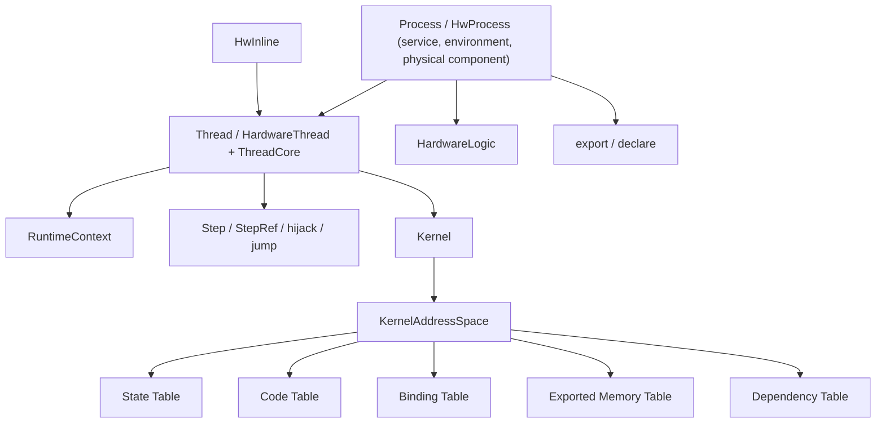

# HwOS 核心概念说明

这份文档讲的是 **当前系统的概念和心智模型**。  
如果你想看实现结构，请读 [architecture.md](/Users/nullstarfish/HwOS_personal/docs/architecture.md)。  
如果你想看更高层的设计哲学，请读 [philosophy.md](/Users/nullstarfish/HwOS_personal/docs/philosophy.md)。

## 概览

当前系统可以用下面这张图快速把握：

## Process

### 它是什么

`HwProcess` 当前更接近：

- service
- environment
- physical component
- assembler

它负责：

- 形成 process 层级
- 持有本地状态
- 创建 / 安装 thread
- `spawn` 子 process
- 在 root 上触发 `kernel.boot()`

### 它不是什么

- 它不是 thread runtime
- 它不是 code segment
- 它不是软件意义上的 OS process

### 它的边界

process 主要提供：

- 共享环境
- 物理边界
- 装配位置

具体控制流执行则交给 `thread`。

## Context

### 它是什么

`HwContext` / `HwContextEntity` 是最小上下文壳。

当前主线下，它主要负责：

- entity 身份
- kernel 挂接
- `export(...)`
- `declare(...)`

### 它不是什么

- 它不是执行单元
- 它不是 ACL / ownership 系统
- 它不是自动 reclaim 接口壳

### 它的边界

当前 `HwContextEntity` 不再承担旧 `own/grant` 语义。  
跨边界正式接口已经收成 symbolic v0 的 `export / declare`。

## Thread

### 它是什么

`HardwareThread` + `ThreadCore` 是当前系统唯一正式的控制流执行宿主。

它负责：

- 收集 `entry { ... }`
- 持有 `RuntimeContext`
- 执行 `Step` 控制流
- 响应 `start / reset / Return`

### 它不是什么

- 它不是 process
- 它不是 function 本体
- 它不是主要的代码复用单元

### 它的边界

thread 更像：

- runtime engine
- CPU host

而不是最终想要被移植和复用的代码对象。

## ThreadDef

### 它是什么

`ThreadDef` 是 definition-first 的 thread code 定义接口。

### 它不是什么

- 它不是执行实例
- 它不是 process

### 它的边界

`ThreadDef` 负责定义 thread code；  
`HwProcess.install(...)` 负责把它安装到具体环境里。

## Step

### 它是什么

`Step` 是 thread 内部的正式控制点。

### 它不是什么

- 它不是寄存器
- 它不是 runtime node 对象
- 它不是一条软件指令

### 它的边界

运行期存在的是 cursor；  
`Step` 是编译期控制点，最终会被映射到 code space 编号。

## StepRef

### 它是什么

`StepRef` 是编译期 step 引用。

当前只有两类：

- `NamedStepRef(name)`
- `NextStepRef`

### 它不是什么

- 它不是 runtime 值
- 它不是地址寄存器
- 它不是 pointer 算术系统

### 它的边界

`jump` 和 `hijack` 的正式目标都是 `StepRef`。  
字符串跳转只是过渡包装，不是主语义。

## Hijack

### 它是什么

`hijack(ref)` 是对某个 `StepRef` 做**编译期 splice**。

### 它不是什么

- 它不是 runtime jump
- 它不是新的 step 启动指令
- 它不是 call

### 它的边界

`jump` 改变运行期控制位置；  
`hijack` 改变编译期展开方式。

## RuntimeContext

### 它是什么

`RuntimeContext` 是 thread runtime 的第一性结构。

当前最小字段：

- `cursor`
- `stateReg`
- `binding`

### 它不是什么

- 它不是 lease
- 它不是 function activation binding
- 它不是 code segment 自身

### 它的边界

`cursor` 和 `stateReg` 负责 thread 本体生命周期。  
普通 thread 的基础原语是 `reset()`，不是系统级 reclaim 对象。

## HwInline

### 它是什么

`HwInline` 是纯 inline 控制段。

### 它不是什么

- 它不是独立执行体
- 它不是 activation slot
- 它不是软件意义上的普通 function

### 它的边界

它直接在当前调用上下文中 emit 控制逻辑。  
如果需要可调用控制段语义，当前主线统一使用 `SysCall.Call(HwInline, ...)` + 显式 `SysCall.Return()`。

## 历史说明：HwFunction

`HwFunction` 是历史 v1 概念，当前主线已移除。  
相关 activation thread / call binding 机制不再作为现行 API。

## Symbolic v0

### 它是什么

当前最轻量的 symbolic 组织方式。

它只承担两件事：

- 可见性
- 依赖记录

### 它不是什么

- 它不是完整链接器
- 它不是默认开发方式
- 它不是所有本地值的追踪系统

### 它的边界

同一 process 内的局部实现仍允许直接 Scala/Chisel 交互。  
只有跨边界 provider/consumer 解耦时，才推荐：

- `export(symbol, signal, caps)`
- `declare(symbol, caps)`

## Exported Resource

### 它是什么

显式通过 `export(...)` 暴露出去的资源。

### 它不是什么

- 它不是所有本地状态
- 它不是自动导出的 process 字段

### 它的边界

只有 exported resource 才进入 exported memory table。  
本地实现细节默认不进入 symbolic 表。

## Process-local Access

### 它是什么

同一 process 内的局部代码直接通过 Scala/Chisel 访问本地状态。

### 它不是什么

- 它不是 symbolic 依赖
- 它不会出现在 dependency table 里

### 它的边界

这是 v0 里保留的本地开发模式。  
symbolic 不应压垮所有日常局部逻辑。

## State Space

### 它是什么

`state space` 是真实硬件状态对象所在的地址空间。

例如：

- `Reg`
- cursor
- `stateReg`
- exported resource backing state

### 它不是什么

- 它不是控制编码空间
- 它不是符号表

### 它的边界

state space 里放“会真正存在的状态”。  
控制编码属于 code space。

## Code Space

### 它是什么

`code space` 是 step / function 控制编码所在的空间。

### 它不是什么

- 它不是寄存器地址空间
- 它不是 memory image

### 它的边界

cursor 是 state object，  
但它保存的是 code space 编号。  
两者通过 binding 联系起来。

## Binding

### 它是什么

`binding` 负责把：

- 某份 runtime state
- 某段 code segment

联系起来。

### 它不是什么

- 它不是 cursor 本身
- 它不是 code table 本身

### 它的边界

它的职责是“解释关系”，不是“存储状态”。

## Reset Hooks

### 它是什么

thread 可以通过 `registerReset { ... }` 注册本地 reset hook。

### 它不是什么

- 它不是系统级 reclaim 框架
- 它不是跨对象 kill 机制

### 它的边界

普通 thread 的基础终止原语仍然是 `reset()`。  
如果某些 lease 或局部状态需要在 reset 时额外清理，应由 thread 显式注册对应 hook。
