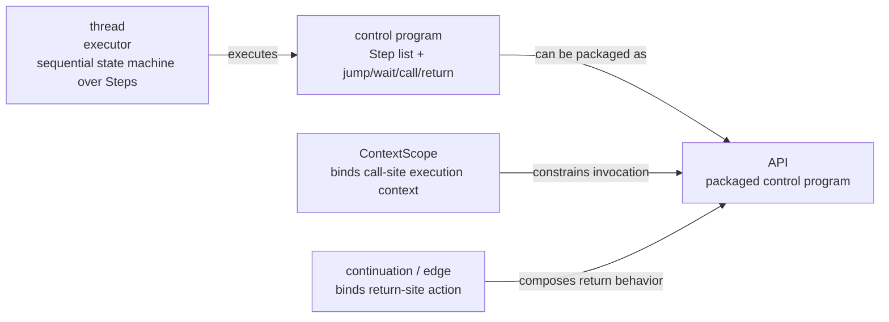

# Control-Flow-First Hardware Construction with Protocol APIs

## Candidate Titles
1. Control-Flow-First Hardware Construction with Protocol APIs
2. From Protocol Wiring to Protocol APIs in Hardware Design
3. Threads, Programs, and Protocol APIs: A Control-Flow-First View of Hardware Construction

## Abstract
Hardware design is still largely organized around structural commitment: modules, wires, and protocol state machines are chosen first, while control semantics emerge only indirectly from those structures. This paper explores a different design center. We present a control-flow-first hardware construction style in which the primary frontend object is a `thread`: a sequential control program over explicit actions such as `Step`, `waitCondition`, `jump`, `Call`, and `Return`. In this model, protocols are packaged as APIs rather than exposed as raw handshake choreography, and backend compilation is responsible for lowering control programs into concrete scheduling, pipelining, and resource-allocation decisions.

We develop this argument through a Chisel-based prototype. First, we show that hardware behavior can be written as control programs rather than structural interconnect skeletons, with `thread` serving as an explicit machine model over step-level timing units. Second, we show that protocol-heavy interactions, such as AXI reads, can be encapsulated as reusable APIs because APIs are packaged control programs executed under the same thread semantics. Third, we show that microarchitectural choices such as asynchronous path decoupling, write ordering, reservation discipline, and commit timing can be pushed into a backend/runtime layer without changing frontend API shape, as illustrated by a decoupled CPU case study and an age-ordered scoreboard regfile. Although the prototype remains an evolving research artifact rather than a finished compiler, it suggests that control-flow-first construction can improve modularity, refactorability, and optimization freedom in hardware design.

## 1. Introduction
Most hardware design languages provide some form of behavioral syntax, but the dominant workflow remains structural. Designers still reason primarily in terms of modules, ports, wires, arbiters, and protocol-specific state machines. Even when the intended behavior is fundamentally sequential, it is typically realized by constructing a web of structural connections first and only then recovering the control story from that web.

This paper explores an alternative viewpoint: what if hardware construction began from control flow rather than structure?

Our prototype takes `thread` as the central frontend abstraction. A thread is neither a software thread nor a simulation convenience. It is simply a sequential list of explicitly named timing units, `Step`s, together with a runtime cursor that advances among them. In this sense, a thread is a state machine with an explicit default sequential order: absent a jump, return, or stall, control falls through from one step to the next. Designers write ordered action sequences such as `Step("Decode") { ... }`, `waitCondition(...)`, `jump(...)`, and `SysCall.Call(...)`; these sequences are then compiled and lowered into hardware state and scheduling logic. The goal is to let frontend code capture *what should happen next* while postponing *how the backend schedules and realizes it structurally*.

From this design center follow two additional ideas. First, once the state-machine writing style has been generalized around `thread` and `Step`, the program being executed can be separated from the executor that runs it. A thread provides the execution model; a reusable control segment is then a program packaged to run on that model. In this view, an API is precisely a wrapper around such a control program. A designer can write an AXI read as a callable transaction rather than manually coordinating `valid`, `ready`, response timing, and return sequencing at every call site. Second, backend lowering becomes the natural place to handle pipelining, arbitration placement, and resource allocation. The frontend should not have to be rewritten every time a long path is split, a service is decoupled, or an execution policy changes.

This shift also changes how larger systems are understood. A conventional synchronous design story often resembles a linear call stack: one stage invokes the next and remains responsible for the full downstream lifecycle. In our model, once calls become asynchronous, the control structure is better understood as an asynchronous call tree. Router-like components, such as decode in our CPU case study, no longer own a single long execution chain; they dispatch into multiple downstream control branches whose timing is resolved by the backend and runtime composition rules.

Figure 1 summarizes this abstraction chain.



**Figure 1.** A `thread` is the execution model, not a hidden runtime mechanism. A protocol API is a packaged control program executed under the same thread semantics. `ContextScope` resolves where a call is issued, while continuation and `edge` semantics resolve what happens when the call returns.

This paper makes three contributions:

1. It presents a **control-flow-first** hardware construction model centered on `thread` as an executable control program.
2. It shows how **protocols as APIs** can make protocol-heavy behavior reusable and compositional, using AXI as a concrete example.
3. It argues for **backend-driven optimization**, using an age-ordered scoreboard regfile as an example where scheduling and ordering policy live below the frontend control description.

More concretely, this paper makes the following contributions:

1. We define `thread` as an explicit hardware execution model rather than a hidden runtime convenience, and show how `Step` yields a programmable sequential state-machine form with first-class control-flow edges.
2. We show that protocol APIs can be understood as packaged control programs, and we demonstrate this interpretation with an AXI read API whose internal timing is closed while call-site and return-site timing remain composable through `ContextScope`, continuations, and edge actions.
3. We show, through a decoupled CPU case study and an age-ordered scoreboard regfile, that backend organization can change from synchronous linear execution chains to asynchronous call trees without forcing a corresponding change in frontend API shape.

The result is not yet a production compiler, and we do not claim full performance competitiveness against mature RTL flows. Our claim is narrower: a control-flow-first frontend can give hardware designers a more stable programming surface while enabling backend experimentation with microarchitectural organization.

## 2. Motivation
The work was motivated by repeated friction during CPU-style prototyping. In a decode-centric implementation, decode gradually accumulated responsibility for decode, execute, memory access, and writeback. This made the control chain long, hard to pipeline, and difficult to refactor. Meanwhile, when a path was extracted into a reusable service, it was easy to accidentally duplicate arbitration logic: both the caller and the callee might introduce ownership or issue control, even when only one layer actually faced a structural hazard.

These problems are symptoms of a deeper issue: the boundary between behavior, protocol, and microarchitecture is fixed too early. Once handshake structure and ownership policy are manually embedded into the frontend, small design changes require large rewrites.

A control-flow-first frontend aims to delay those commitments. The designer writes ordered actions and API calls; the backend determines where runtime state lives, where steps become standalone code slots, and where scheduling or arbitration is actually necessary.

## 3. Thread as the Control-Flow Abstraction
The first claim of this work is that hardware can be described as sequences of actions rather than primarily as structural connections. In our system, the central frontend abstraction is the `thread`.

A thread is the formal execution host of a hardware control program. It owns a runtime cursor, has explicit lifecycle state (`active`, `done`, `reset`), and executes a program built from named `Step`s. Each step contains ordinary Chisel statements together with control actions such as `jump`, `hijack`, `waitCondition`, `SysCall.Call`, and `SysCall.Return`. Importantly, this abstraction does not hide a mysterious scheduler. A thread is simply a state machine whose state-transition vocabulary has been made explicit and programmable: `Step` is the timing-level unit, and the default semantics are sequential execution from one step to the next unless control is redirected or stalled. The important point is that the designer writes these as a control narrative: what this hardware does next, under what condition it stalls, and where it returns.

One useful way to understand this abstraction is to compare it with software assembly. In our view, `Step` plays a role analogous to an instruction-level unit in assembly, while `thread` provides the execution model that steps run on. The analogy is not exact, but it is productive: the frontend is intentionally close to a control-flow assembly for hardware. The most important structural difference is that our model is a complete control-flow graph (CFG): both nodes and edges are first-class programmable objects. A `Step` is a node, but return edges, jump edges, and patched edges can also carry behavior. In contrast, conventional software assembly primarily places instructions on nodes; edge behavior is usually implicit in branch semantics rather than programmable as its own action site.

| Dimension | Conventional software assembly | This work's control-flow assembly |
| --- | --- | --- |
| Execution host | CPU core | `thread` |
| Program unit | instruction | `Step` |
| Control-flow representation | node-centric instruction stream | explicit CFG with programmable nodes and edges |
| Default sequencing | `PC := PC + 1` | fallthrough to next `Step` |
| Redirected control | branch / jump / call / return | `jump` / `hijack` / `SysCall.Call` / `SysCall.Return` |
| Where actions can attach | primarily node-local | node-local and edge-local (`StepRef.edge.add`, call edges) |
| Stall mechanism | hidden in microarchitecture | explicit `waitCondition` in program |
| Resource actions | loads/stores/ALU ops via ISA | arbitrary Chisel actions inside `Step` |
| Program representation | binary / assembly text | step-based control program |
| Executor vs program | fixed ISA executor runs many binaries | `thread` executes many packaged control programs |
| Reusable subroutine | function / procedure | API as packaged control program |

The most important difference is that our "assembly" is not an ISA for a general-purpose processor. It is a hardware-construction interface. Nevertheless, the same separation of concerns appears: `thread` acts like a machine model, while `Step`-based programs act like authored control code for that machine. Unlike software assembly, however, our model is not merely a list of node-local operations. It is a programmable CFG in which edge timing is part of the frontend language.

This matters because it changes how the code is organized. Instead of beginning from a graph of modules and wires, the frontend begins from a sequence of actions:

```scala
worker.entry {
  worker.Step("Issue") {
    bus.ar.valid := true.B
    worker.waitCondition(bus.ar.ready)
  }
  worker.Step("Receive") {
    worker.waitCondition(bus.r.valid)
    when(bus.r.valid) {
      response := bus.r.data
      SysCall.Return()
    }
  }
}
```

This example still lowers to hardware with explicit registers and control state, but the authored program is organized around control flow. In our experience, this organization makes large refactors easier. A long path can be split by inserting a new step or by moving a call boundary, without immediately forcing a redesign of the surrounding structural wiring. Likewise, edge-local behavior can be attached through `StepRef.edge.add { ... }`, which now supports arbitrary action blocks rather than only special-cased control primitives.

The thread abstraction therefore serves two roles at once: it gives the user a concrete execution model, and it gives the backend a structured control program to optimize.

## 4. Protocols as APIs
The second claim is that handshake protocols and pipeline interactions can be packaged as APIs rather than exposed as raw protocol choreography at every use site.

The conceptual bridge from threads to APIs is that the thread model makes state-machine construction uniform. Once behavior is written as a control program over `Step`s, we can decouple the executor from the program it executes. A `thread` is the executor model; a reusable protocol operation is a packaged program meant to run on that executor. APIs are therefore not foreign to the model: they are simply named and reusable control programs with call/return boundaries.

Our AXI read example illustrates the point. In a conventional style, each use site would directly manipulate `ar.valid`, observe `ar.ready`, later assert `r.ready`, wait for `r.valid`, check `r.resp`, and finally move data into the surrounding control path. In our prototype, this interaction is wrapped as a reusable callable unit:

```scala
def axi_read(bus: Axi4ReadOnly, addr: UInt): HwInline[UInt] =
  HwInline.thread("axi_read") { t =>
    t.Step("IssueAddr") {
      bus.ar.valid := true.B
      bus.ar.addr := addr
      t.waitCondition(bus.ar.ready)
    }

    t.Step("WaitData") {
      bus.r.ready := true.B
      t.waitCondition(bus.r.valid)
      when(bus.r.valid) {
        responseData := bus.r.data
        SysCall.Return()
      }
    }

    responseData
  }
```

The call site then expresses intent rather than protocol choreography:

```scala
val value = SysCall.Call(axi_read(io.axi, addrReg))
```

This is not merely syntactic sugar. The API boundary establishes a reusable control segment with explicit call/return semantics. The caller does not need to re-encode the handshake protocol each time, and protocol evolution can be localized. More importantly, the API exists because the program has already been separated from the executor: the same thread semantics that make handwritten state machines possible also make them packageable. At the same time, the resulting hardware remains explicit: the API is still lowered into concrete handshake behavior, and return edges can still carry additional actions through call-site patches.

An important subtlety is that API-izing a protocol requires two different kinds of timing treatment. The API's *internal* timing must be closed: this is precisely what makes it possible to encapsulate a protocol at all. An AXI read API works because the sequence of issuing an address, waiting for acceptance, waiting for data, and returning a result is packaged as one local control program with determinate internal timing semantics. However, the *external* timing of the call is intentionally left open. The user may invoke that API from different control contexts, and the action taken at the return boundary may also differ across sites.

Our framework handles these two open ends explicitly. `ContextScope` determines the execution context of a call: it specifies which executor is currently active and therefore how a packaged control program is legally invoked and composed. At the other end, continuations and `edge` patches determine what happens when the call returns. A return may continue into an explicit next `Step`, or it may directly trigger a guarded action attached to the return edge. In this sense, an API call in our framework is itself a CFG-level object: its timing may be initiated from a node, but its completion semantics may be realized either as node-local continuation code or as edge-local actions. This split is essential to the framework's notion of protocol APIs: internal timing is closed inside the packaged program, while call-site and return-site timing remain composable.

The same style extends beyond bus protocols. In our prototype CPU, execution paths and commit operations can be turned into service-like APIs rather than directly embedded into decode logic. The important distinction is that protocol/API boundaries capture *semantic transactions*; they need not freeze a specific ownership or arbitration policy into the frontend.

## 5. Backend-Driven Optimization
The third claim is that scheduling, pipelining, and resource allocation should be handled by a backend compiler or runtime lowering layer rather than being baked into the frontend control description.

Our regfile stack provides a concrete example. The frontend can interact with a register file through operations such as `Read`, `Reserve`, and `WritebackAndClear`, but the actual implementation is layered. A minimal base regfile provides direct storage. A semaphore-backed variant adds explicit write-slot control. An age-ordered scoreboard regfile adds reservation tracking, in-flight ordering, and delayed publish/commit discipline through an ordered window.

The most interesting case is `AgeOrderedScoreboardRegfileProcess`. From the caller's perspective, a write follows a clean sequence such as:

```scala
val writePort = SysCall.Inline(regFile.RequestWritePort(portIdx))
SysCall.Inline(writePort.Reserve(addr))
...
SysCall.Inline(writePort.WritebackAndClear(addr, data))
```

Yet the backend/runtime implementation maintains substantially richer policy:

- reservation of the architectural destination,
- buffering of pending writes,
- readiness tracking for produced data,
- age-ordered publication through an ordered window,
- release of scoreboard and write-port resources only at commit time.

This is exactly the sort of policy we do not want frontend algorithm code to spell out repeatedly. The frontend names the intended actions. The backend and library implementation decide where the state lives, when publication becomes visible, and how ordering is enforced.

This separation is especially important for pipeline exploration. If the designer wants to move reserve earlier, split commit from execute, or change whether a path blocks or decouples, the right place for those changes is the lowering and service organization layer. Otherwise, every optimization attempt turns into a large semantic rewrite.

## 6. Case Study: From Decode-Centric Execution to Asynchronous Control Routing
The prototype CPU in our repository began with a decode-centric organization. Decode effectively owned most of the end-to-end lifecycle: interpreting instruction fields, invoking execution, waiting for service completion, and performing writeback. That organization was easy to start with, but it also serialized too much behavior through one control path. The core problem was not simply that some functionality lived in one module rather than another; the deeper problem was that execution paths were invoked synchronously, so decode remained responsible for the callee's lifecycle.

The key refactoring was therefore not "turning paths into processes" as such. The important transformation was to make those paths **asynchronous calls** while keeping the frontend API shape unchanged. From the caller's perspective, the interface remained a request-oriented API. What changed was the backend realization: once execution paths and commit were decoupled, decode no longer had to wait through their full internal timing. This is precisely the kind of change our backend-optimization thesis is meant to support. A frontend algorithm should not need to change merely because the backend adopts a more decoupled scheduling structure.

This refactoring also changed the role of decode. In a conventional view, decode is often treated as the beginning of a long execution chain. In our refactored view, decode more closely resembles a **router**. It interprets the instruction, selects the downstream service path, and launches an asynchronous transaction into the appropriate execution flow. This turns what would otherwise look like a linear function-call stack into an asynchronous call tree. The CPU can then be understood in a thread-centric way: control is carried by threads and their calls, while services advance those threads through asynchronous execution/commit structure.

Table 2 summarizes how several familiar CPU concepts are reinterpreted in this control-flow-first model.

| Conventional CPU notion | Control-flow-first reinterpretation |
| --- | --- |
| Decode stage | decode router over control/API destinations |
| Pipeline stage | asynchronous linear function-call segment |
| Backpressure | thread-level blocking or stalled continuation |
| Stage handoff | asynchronous call into another control program |
| Execution unit invocation | API call into a packaged program |
| Writeback stage | independent commit service / continuation point |
| Structural hazard | resource conflict handled at the actual service boundary |
| Pipeline control | composition of thread blocking, calls, and returns |

This case study also sharpened our understanding of arbitration placement. Some layers genuinely need arbitration because they mediate scarce physical resources, such as load ports or arithmetic ports. Other layers do not. The control-flow-first split makes this distinction easier to preserve. Once decode is treated as a router rather than as the owner of every callee lifecycle, arbitration can be placed where structural hazards actually exist rather than duplicated at every abstraction boundary.

## 7. Discussion
The central message of this work is not that wires, ports, or explicit protocols should disappear. Hardware remains hardware. Rather, we argue that the *frontend factoring* can change. Control intent can be written first, APIs can represent transactions, and lowering can reintroduce the structural machinery required by the implementation.

This perspective is especially valuable for exploratory microarchitecture work. In conventional RTL, changing a pipeline cut often means rewriting control, protocol, and resource ownership simultaneously. In our model, those concerns can be teased apart. The frontend remains a control program; the backend absorbs more of the scheduling burden.

There are limits. Our current system still has rough edges, and some analyses remain conservative. We do not yet claim a full optimizing compiler or a complete out-of-order story. Still, even in its present form, the prototype suggests that control-flow-first construction is a viable research direction for making hardware more programmable without pretending that it is software.

## 8. Limitations and Future Work
This artifact is still an active prototype. Some internal layers remain under cleanup, and our evaluation is currently stronger on programmability and refactorability than on finalized area/performance numbers. In particular, while backend-driven optimization is a central thesis of the work, the current implementation should be understood as a proof of direction rather than a fully developed optimization framework.

Several next steps follow naturally. We need stronger static analyses for edge-local control behavior and return-path guarantees. We also need broader benchmarks and more systematic comparisons against conventional RTL workflows. Finally, the protocol-as-API idea should be tested beyond AXI and simple service calls, ideally on a broader family of standard protocols and larger designs.

## 9. Conclusion
This paper presented a control-flow-first hardware construction style centered on `thread` as an executable control program, protocols as reusable APIs, and backend-driven microarchitectural optimization. Through concrete examples from our prototype, we showed how a thread-centered frontend can express hardware behavior as sequences of actions, how an AXI interaction can be lifted into a callable API, and how a regfile backend can internalize ordering and resource-allocation policy without burdening frontend code.

Our argument is not that structural design disappears, but that it can move later in the flow. By treating control as the primary frontend object and structure as a lowering concern, hardware design may gain a more stable programming surface for iteration, reuse, and backend experimentation.
